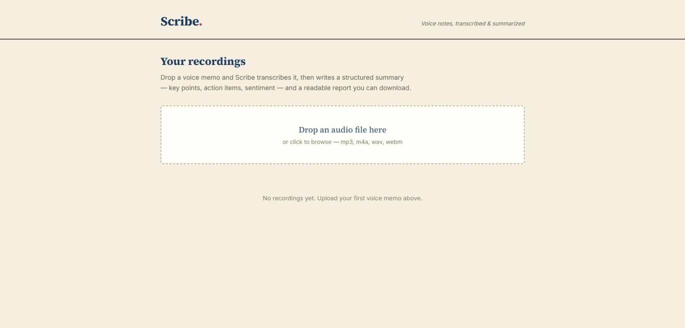

# Scribe Agent


**[Live demo](https://scribe-agent-red.vercel.app)**



Drop a voice memo, get a structured report. Scribe Agent transcribes an audio recording with Whisper, then has an LLM turn the transcript into a structured summary — title, key points, action items, follow-ups, sentiment — plus a clean downloadable Markdown report.

Built as an original full-stack app (FastAPI + React) inspired by an n8n voice-memo automation, re-architected as a real product where **each user brings and controls their own API keys** — no shared or public credentials.

## How it works

1. Drop or select an audio file (mp3, m4a, wav, webm) on the dashboard.
2. The backend transcribes it with an OpenAI-compatible Whisper endpoint, in the background.
3. An LLM turns the transcript into a structured report: title, summary, main points, action items, follow-ups, references, sentiment.
4. A second LLM pass converts that structure into a readable Markdown report.
5. Everything shows up on your dashboard — read it inline, download the Markdown report or the raw transcript, or delete it.

## Features

- Drag-and-drop audio upload, processed asynchronously with live status
- AI transcription (Whisper-compatible endpoint)
- Structured summary: main points, action items, follow-ups, stories, references, arguments, related topics, sentiment
- Auto-generated Markdown report, downloadable
- Raw transcript always available for download
- Bring-your-own-keys: your own LLM (and transcription) API key, never shared

## Tech stack

**Backend:** FastAPI, SQLAlchemy, PostgreSQL (SQLite for local dev), OpenAI-compatible LLM client, BackgroundTasks for async processing
**Frontend:** React (Vite), React Router

## Project structure

```
backend/
  app/
    config.py             settings from environment variables
    database.py             SQLAlchemy engine + auto schema sync
    models.py                 Recording (status, transcript, structured report)
    routers/
      recordings.py            upload, list, detail, delete, downloads
      status_router.py          config status
    services/
      transcription.py          Whisper-style transcription call
      summarizer.py              structured JSON summary + Markdown conversion
      pipeline.py                 orchestrates the background job
frontend/
  src/
    pages/
      Home.jsx               upload dropzone + recordings list
      RecordingDetail.jsx     full report view
    components/
      Layout.jsx                masthead nav
```

## Running locally

### Backend

```bash
cd backend
python -m venv venv
venv\Scripts\activate
pip install -r requirements.txt
cp .env.example .env   # fill in your own keys
uvicorn app.main:app --reload --port 8091
```

### Frontend

```bash
cd frontend
npm install
cp .env.example .env
npm run dev
```

## Deploying your own instance

**Backend (Render):**
- New Web Service, root directory `backend`
- Build command: `pip install -r requirements.txt`
- Start command: `uvicorn app.main:app --host 0.0.0.0 --port $PORT`
- Environment variables: `DATABASE_URL`, `LLM_API_KEY`, `LLM_MODEL`, `LLM_BASE_URL`, `TRANSCRIPTION_MODEL`, `CORS_ORIGINS`

**Frontend (Vercel):**
- New Project, root directory `frontend`
- Environment variable: `VITE_API_URL` pointing to your Render backend URL

## Status

This is an MVP built for portfolio/demo purposes. It requires your own LLM API key — no credentials are shared or included. Note: transcription needs a provider that supports the Whisper-style `/audio/transcriptions` endpoint (OpenAI or Groq both work; some OpenAI-compatible providers, like Gemini's compatibility layer, do not support this endpoint).
